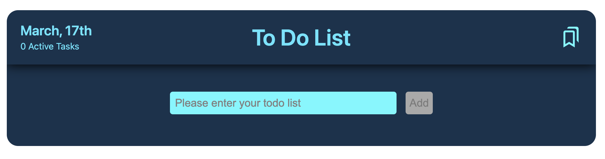

<!-- prettier-ignore -->
* this ordered seed list will be replaced by the toc 
{:toc}

## Intro

---

주위 개발자 중에 TDD를 사용하는 개발자가 있어서 TDD에 대해서 얘기만 대충 들어봤지 실제로 적용한적은 없었다. 현업에서 하는 프로젝트는 TDD를 사용하지 않기도 하고 적용하기에는 프로젝트가 너무 커져서 적용이 힘들꺼 같다고 얘기하셔서 혼자서 적용해 보려고 한다.

그래서 TDD가 정확히 무엇이며 어떻게 사용하는지 이번에 간단한 프로젝트인 Todo list를 이용해 적용해보려고 한다.

## TDD란?

---

과연 많이 듣고 접했던 TDD란 무엇일까?  
TDD란 테스트 주도 개발(Test Driven Development)의 약자로써 **테스트 주도 개발**이라고 한다. 또한 TDD는 애자일 방법과 Extreme Programming. 기법에서 유래되었다고 나와있다.

> Extreme Programming줄여서 XP는 1999년 켄트 벡이 발표한 프로그램 개발 방식으로, 빠르게 고객과 소통하며 개발할 수 있는 방법이다.

TDD는 하는데는 순서가 있다. 먼저 실패하는 테스트 코드를 먼저 작성하고, 성공하는 코드를 작성한다 그 후 리팩토링을 하는 순서로 이어진다. 그럼 이제 프로젝트에 적용해자.

## React 프로젝트 세팅

---

1. `npx create-react-app my-app --template typescript` 리액트 프로젝트를 먼저 생성한다.
2. `npm install --save-dev jest` devDependencies에 jest도 함께 설치해준다.
3. `npm i node-sass` 나는 scss를 이용해 스타일을 진행할 예정이다.
4. `npm i dayjs` 오늘 날짜를 가져오고 날짜를 손쉽게 하기 위한 라이브러리를 설치해준다.
5. `npm i classnames` 조건부로 클래스를 주고 싶기 때문에 해당 라이브러리도 함께 설치한다.
6. `npm install react-icons --save` list를 지울때는 icon을 사용할꺼기 때문에 react icon을 설치해준다.
7. `npm install --save-dev @babel/preset-env @babel/preset-typescript` 나는 타입스크립트를 사용하기 때문에 사전 설정을 함께 해준다.

## 폴더 구조

---

```
├─ node_modules
├─ public
├─ src
│  ├─ App.tsx
│  ├─ app.scss
│  ├─ components
│  │  ├─ TodoListForm.tsx
│  │  ├─ TodoListHeader.tsx
│  │  └─ TodoListItems.tsx
│  ├─ index.tsx
│  ├─ styles
│  │  ├─ global.scss
│  │  └─ reset.scss
│  ├─ tests
│  │  ├─ TodoListForm.test.tsx
│  │  ├─ TodoListHeader.test.tsx
│  │  └─ TodoListItem.test.tsx
│  └─ type.ts
├─ .gitignroe
├─ .prettierrc
├─ .babel.config.js
├─ .package-lock.json
├─ .package.json
├─ .README.md
├─ .tsconfig.json
```

전체적인 폴더구조는 위와 같이 설계를 하였다. 먼저 components에 todo list 상단 부분인 `TodoListHeader`, 입력과 버튼이 있는 `TodoListForm`, 리스트를 보여주는 `TodoListItems`부분으로 나눴고 tests폴더에도 동일하게 구조를 나눠놨다. 그리고 styles같은 경우 초기에 설정만 해놓고 각 컴포넌트별로 스타일을 구분하지 않고 `app.scss`에 모든 스타일을 같이 사용했다.

## UI 구현

---

나는 전체적인 퍼블리싱을 다 하는 편이고 scss를 주로 쓴다. 그리고 디자인은 [dribble](https://dribbble.com/shots/19644413-Todo-List-React-App)이라는 사이트에 있는 하나 가져와서 퍼블리싱을 진행하기로 했다. 퍼블리싱 작업은 크게 어려운게 없었기 때문에 빠르게 진행됐던거 같다. 나는 `app.scss`파일 안쪽에 웹상에서 제일 중간으로 위치시켰고. Todo List를 시작해서 상단, input과 button영역, 리스트라인 크게 3가지로 분류해서 퍼블리싱을 진행했다.

지금은 데이터적인 부분을 건들지 않았기에 리스트 부분은 하드코딩을 진행했다. 추후 map을 이용하여 동적으로 변경할 예정이며, Todo List의 퍼블리싱은 [Github](https://github.com/owni14/react-todo-list-tdd/blob/main/src/app.scss)에서 확인할 수 있으니 혹시 참고할 사람들은 참고하면 좋을꺼 같다.



## Reference

---

- [https://inpa.tistory.com/entry/QA-%F0%9F%93%9A-TDD-%EB%B0%A9%EB%B2%95%EB%A1%A0-%ED%85%8C%EC%8A%A4%ED%8A%B8-%EC%A3%BC%EB%8F%84-%EA%B0%9C%EB%B0%9C](https://inpa.tistory.com/entry/QA-%F0%9F%93%9A-TDD-%EB%B0%A9%EB%B2%95%EB%A1%A0-%ED%85%8C%EC%8A%A4%ED%8A%B8-%EC%A3%BC%EB%8F%84-%EA%B0%9C%EB%B0%9C)
- [https://www.browserstack.com/guide/what-is-test-driven-development](https://www.browserstack.com/guide/what-is-test-driven-development)
- [https://namu.wiki/w/%EC%9D%B5%EC%8A%A4%ED%8A%B8%EB%A6%BC%20%ED%94%84%EB%A1%9C%EA%B7%B8%EB%9E%98%EB%B0%8D](https://namu.wiki/w/%EC%9D%B5%EC%8A%A4%ED%8A%B8%EB%A6%BC%20%ED%94%84%EB%A1%9C%EA%B7%B8%EB%9E%98%EB%B0%8D)
- [https://dribbble.com/shots/19644413-Todo-List-React-App](https://dribbble.com/shots/19644413-Todo-List-React-App)
- [https://www.npmjs.com/package/node-sass](https://www.npmjs.com/package/node-sass)
- [https://react-icons.github.io/react-icons/](https://react-icons.github.io/react-icons/)
